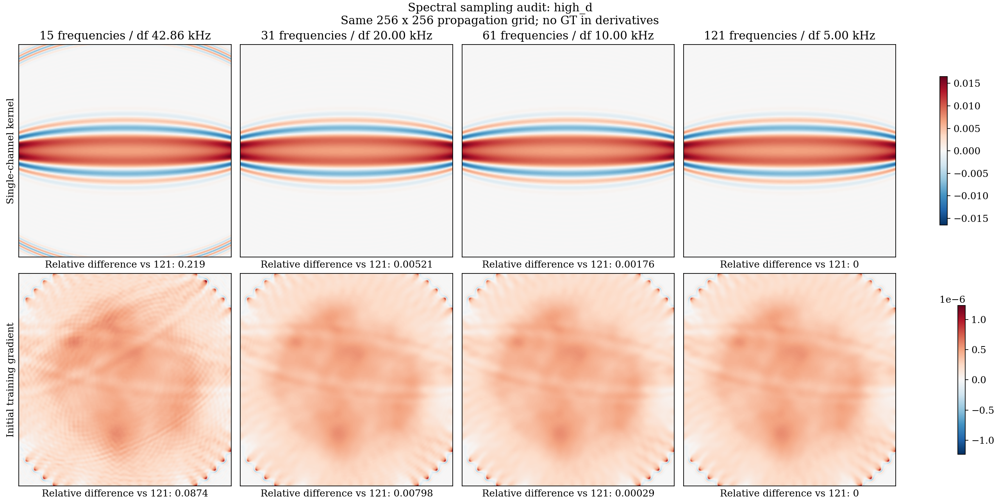

# 多频带有限频率旅行时：模型、验证与验收范围

## 为什么考虑多频带

此前 xcorr 使用的是有限带宽时间波形，不是单个 FFT 频点，但最终把每条通道压缩为一个延迟。
本轮区分两个问题：保留不同频带的观测信息，以及使每个观测使用与其定义一致的前向和导数。

无色散的几何直线模型 $A\delta s$ 和 Eikonal 首达时 $T(c)$ 本身不依赖频率。
对同一个 $A$ 堆叠多个频带，不能自动获得不同的衍射灵敏度核。等权情形有

$$
\sum_b\|A\delta s-d_b\|^2
=B\|A\delta s-\overline d\|^2+\sum_b\|d_b-\overline d\|^2.
$$

因此单纯堆叠等价于拟合频带平均值，不能通过增加迭代消除第二项。
不同权重可改变噪声平均和覆盖，但不改变几何算子的物理模型。
本次介质没有被假定为频率相关声速；不能为拟合衍射差异而虚构材料色散。

## 已实现的观测与链式导数

令 $Q_{fsr}=P_{fsr}/P^0_{fsr}$，使用同一独立水参考及固定频带权重 $a_{bfsr}$。
权重包含水谱能量，并在每个频带/通道内归一化。观测定义为

$$
\tau_{bsr}(Q)=\underset{\tau\in[l_{sr},u_{sr}]}{\arg\max}
\operatorname{Re}\sum_f a_{bfsr}Q_{fsr}e^{-i\omega_f\tau}.
$$

正号 Fourier 变换下，纯延迟为 $Q=\exp(i\omega\tau)$。
搜索边界由实际几何、1500 m/s 水速及 1300–1700 m/s 物理边界确定，不读 GT。
网格搜索定位最大峰后，用有界 Newton 更新求驻点。边界峰、低曲率、弱相干和竞争峰单独标记。

对于唯一的内部峰，隐函数导数为

$$
D\tau(Q)[\delta Q]=
\frac{\sum_f a_f\omega_f\operatorname{Im}(\delta Q_fe^{-i\omega_f\tau})}
{\sum_f a_f\omega_f^2\operatorname{Re}(Q_fe^{-i\omega_f\tau})}.
$$

这不是只在水背景、零延迟处的一次展开；每次非线性迭代重算峰位置、曲率和传播场。
峰切换仍然是非光滑的，因此不能仅凭局部导数检验声称全局无周跳。

前向与 Jacobian 为

$$
F_b(m)=\tau_b\left(P(m)/P^0\right),\qquad
J_b=D\tau_b\left(P(m)/P^0\right)\,\operatorname{diag}(1/P^0)\,DP(m),
\qquad m=c^{-2}.
$$

复数到实数的链式伴随全部保留。传播使用现有二维常密度、无衰减的 Full-Green 体积分模型；
它与本轮 k-Wave 验证采集对应，但不自动适用于一般三维、含衰减/变密度的临床测量。

**名称边界：这是 wave-equation / finite-frequency traveltime 扩展，不是把 Full-Green 改名为直线 CGLS 或几何 Bent。**
内层正规方程使用已有 Krylov 求解，外层重线性化、物理边界与实际非线性目标线搜索。
原注册算法和生产 MATLAB FWI 主线没有替换。

### 两种不能混淆的相关观测

默认 `--delay-reference water` 使用上面的水参考延迟差。另一个对照
`--delay-reference observed` 直接计算预测与实测的相关峰：

$$
\epsilon_b(m)=\underset{\epsilon}{\arg\max}\operatorname{Re}
\sum_f a_{bf}Q_f(m)\overline{Q_f^{\mathrm{obs}}}e^{-i\omega_f\epsilon}.
$$

目标是使 $\epsilon_b$ 接近零，而不是分别拾取两个水参考峰后相减。
对于形状相同、只有时间平移的波形，两种定义一致；波形畸变后不保证一致。
这是对论文非线性相关定义的独立检验，不把一个定义的观测交给另一个定义的导数。
链式导数额外包含 $\overline{Q^{\mathrm{obs}}}$，已检查有限差分、伴随和通道局部性。
为复用已有非零归一化分母，脚本保存的预测为水参考观测延迟加 $\epsilon_b$；
残差仍恰好为 $-\epsilon_b$。这是数据相关的失配泛函，不能冒充独立于数据的几何前向模型。
相对延迟边界由两个允许介质的传播时间差确定，不根据 GT 或留出数值调整。

## 文献依据

- [Korta Martiartu 等，2019，3D Wave-Equation-Based Finite-Frequency Tomography for USCT](https://arxiv.org/abs/1908.03302)：医学超声中的有限频率旅行时及水参考。
- [Van Leeuwen 与 Mulder，2010](https://doi.org/10.1111/j.1365-246X.2010.04681.x)：强调相关观测与灵敏度定义一致，讨论幅度谱变化对相位差估计的影响。
- [Marquering 等，1999](https://academic.oup.com/gji/article/137/3/805/614927)：有限频率旅行时与空间灵敏度。

这里实现的是明确写出的有限带宽相关峰泛函，不声称完整复现上述文章的全部流程。

## 受控实验协议

- 相同已有原始压力、水参考、实际采样时间，不重生成乳腺数据。
- 64 TX×64 RX，256×256 反演网格，15 个固定频率。
- NBP D：200–800 kHz；OpenBreastUS HET：80–250 kHz。
- `single` 是覆盖这些频率的一个宽频带，不是单频。
- `multi` 是三个固定、重叠频带；这是联合多频带目标，不能冒充已经验证的由低到高频率 continuation。
- 公共通道掩码为宽频带/三个子带的质量交集，两种目标采用相同通道和均匀权重；除以频带数以归一化。
- 所有模式都使用完整谱的公共 QC，`low` 只限制目标函数的信息，不宣称仅采集了低频。
- 公共接收器留出 12.5%、seed=42、排除互易泄漏；重叠频带不是独立频率验证。
- 水初值，不提供 GT ROI；15 次外迭代上限、每次 12 个内迭代、最大单步 12 m/s、7200 s 上限。
- 使用同一个相对正则化规则：仅训练通道的四个 Rademacher 探针估计对角尺度，阻尼为其中位数的 0.02 倍。
- 留出用于停止和 checkpoint 选择，属于 validation，不是 untouched test。GT 只用于前向归因或反演后的组织区 RMSE/PSNR/SSIM。

上述规则保持的是相同的调参规则，不是相同的绝对正则系数：换频带会改变 Jacobian。
需要固定空间目标的单因素对照时，可用 `--damping-absolute VALUE`，其中 `VALUE`
取自已冻结参考运行 `config.yaml` 的 `damping` 字段，而不是 `damping-ratio`。
它与 `--damping-ratio` 互斥，并在新配置中标记 `fixed_absolute_coefficient`。
同时应保持传播网格、物理正则长度、正则类型、初值和每对通道总权重不变。
默认仍是原相对规则；固定系数也不代表已找到最优超参数。

## 验证与结果状态

已完成：延迟符号与有限平移、正通道增益不变性、局部性、坏通道、相关峰导数有限差分、
复数到实数伴随、非均匀介质全链有限差分，以及水初值的小型非线性重建测试。
小型同模型测试属于数值 sanity，不替代独立 k-Wave 成像验收。

8 TX×64 RX 的独立数据前向归因（原生逐频带 QC）：

| 样本 | 三个频带延迟 RMSE，ns | 说明 |
|---|---|---|
| NBP D | 1.378 / 1.178 / 1.175 | CPU 前向，约 160.5 s |
| OpenBreastUS HET | 2.716 / 3.829 / 5.318 | CPU 前向，约 239.9 s |

同一 NBP D 检查的 CUDA 结果在所报精度内一致，耗时约 52.5 s。
GPU 使用 CuPy complex128 FFT/GMRES 和矩阵乘法，保留原体积分离散、参考场和残差容差。
CPU/GPU 压力、Jacobian 和伴随一致性已测试；没有把更低精度模型伪装成加速。

64×64 公共掩码前向验收已完成：

| 样本 | 三频带延迟 RMSE，ns | 有效通道比例 | 训练相对残差 | 留出接收器相对残差 |
|---|---|---|---|---|
| NBP D | 1.427 / 1.267 / 1.211 | 0.99927 | 0.00604 | 0.00651 |
| OpenBreastUS HET | 2.571 / 3.720 / 5.321 | 0.98983 | 0.00239 | 0.00248 |

这些是 **GT 处的前向归因**，不是从未知模型反演的成像成绩。
四组无平滑水初值反演中，HET 三频带已经以 `line_search_failed` 停止，
其训练/留出相对残差约为 0.720/0.586，组织区 RMSE 41.32 m/s、PSNR 9.37 dB、SSIM 0.141。
因此前向匹配不能证明优化已成功，更不能声称本轮多频带成像已经优于单宽带。

后续受控方向：

- 水初值的稳定化对照：方向平滑 1 pixel，正则化长度为最短波长的 0.35 倍；
  单宽带与三频带采用同一规则，仍对原始非线性目标做线搜索。
- 训练通道的 `phase_cgls` 初值：复用已有 rWave 初始化流程，80 内迭代、
  Laplacian 参数 0.02、3 mm 平滑，保留水初值对照。没有 GT ROI，也不使用验证接收器及其互易通道。
  这只是近似初值，后续残差始终通过有限频率模型计算。
- 直接预测/实测相关失配，检验峰切换和观测定义的影响；不预先宣布优于水参考定义。

首批稳定化任务因 NumPy 标量不能被 YAML 序列化而在反演前失败。
失败日志保留，修复为 Python `float` 后使用新输出目录重新运行，并增加回归测试。

**完整成像目标尚未验收。**
每次接受迭代写入 `progress.json` 与原子替换的 `checkpoint.npz`；最终写入 `result.h5`、
`metrics.json`、`metadata.yaml`、`preview.png`。失败和未收敛运行必须保留停止原因。

### 已确认的频率求积问题

本轮新增试验最初选择的 15 个频点不足以稳定近似宽带灵敏度。
这不是此前原始 k-Wave 数据损坏的证据，也不能据此解释历史上所有几何射线重建的失败。

固定 NBP D 的网格、宽频带、水谱和一个近直径通道，逐步增加频点，得到：

| 频点数 | 频率间隔 kHz | 单通道核相对 121 点差异 | 初始训练梯度相对 121 点差异 |
|---|---|---|---|
| 15 | 42.857 | 21.901% | 8.739% |
| 31 | 20 | 0.521% | 0.798% |
| 61 | 10 | 0.176% | 0.029% |
| 121 | 5 | 参照 | 参照 |

15 点频率间隔对应的谱重复周期约 23.33 us，所选通道在网格上的最大额外路径时间
约 28.09 us，周期性副本会落入模型区域。相关灵敏度的解析脉冲回归测试也确认了这种晚时副本。
上述核差异不使用 GT；梯度差异还包含观测求积及少量 QC 通道变化，不能全部解释成纯核误差。
121 点是更密的数值参照，不是连续频率精确解；该结果也不证明所有通道、所有样本均已收敛。

脚本默认改为 61 点；原始 15 点失败结果保留，并以相同稳定化规则进行 61 点反演对照。
增加求积点不增加原始采集的物理带宽，也不是重新生成高频数据。
其他采集必须重复核收敛检查，不能照搬一个固定点数作为普适验收标准。



复现上述数组与图：分别使用 `--kernel-only --bands single --frequency-count N`
生成 15/31/61/121 点诊断，再运行 `scripts/render_frequency_sampling_audit.py --runs "$RUN_ROOT"`。
目录名使用 `kernel_high_d_f15` 等。图中每一行共用色标，没有按各幅图单独归一化。

## 复现入口

根据 NVIDIA 驱动/Toolkit 选择一个可选依赖，不能同时安装两个 CuPy 发行包：

```bash
pip install -e '.[performance,cuda11]'
# CUDA 12 环境可改用 .[performance,cuda12]；CPU 用户不需要 CUDA extra。
export PYTHONPATH="$PWD/src${PYTHONPATH:+:$PYTHONPATH}"
export OPENBLAS_NUM_THREADS=1 OMP_NUM_THREADS=1
python scripts/run_finite_frequency_traveltime.py \
  --acquisition "$ACQUISITION" --case "$CASE" --out "$RUN_ROOT/multi_fresh" \
  --bands multi --tx-stride 1 --gpu 0
```

改用 `--bands single` 运行公共宽频带对照。`--audit-only` 仅执行显式 GT 处前向诊断。
省略 `--gpu` 使用 CPU；CUDA 后端需要有 GPU 的测试验收，缺失依赖不会静默回退。
原始数据、checkpoint 和运行数组只保存在仓库外。
初值对照添加 `--initialization phase_cgls`；稳定化添加
`--smooth-sigma 1 --regularization-length-wavelengths 0.35`。
各次运行保存脚本哈希及源码哈希，不覆盖失败记录。原始首批运行的四次对角探针被旧脚本计入
`diagonal_adjoint`/forward 计数；后续脚本改为 `adjoint` 加独立 `diagonal_probes`。
这一记账修复不改变数值算法；比较工作量时必须校正这四次设置调用，不能直接比较旧 forward 总数。
