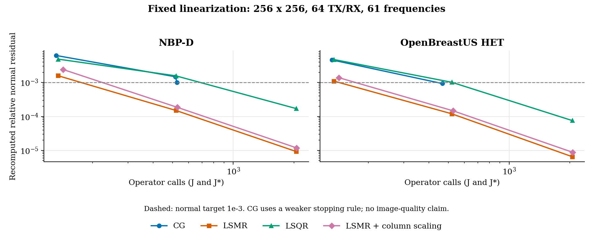

# 秩亏与病态子问题：稳定最小二乘求解

## 问题与范围

低 GT 前向误差不能保证反问题可辨识，也不能证明求解器已收敛。
本轮固定观测、训练划分、Jacobian 和正则项，专门检查数值子问题。
不改变物理模型、不通过增加正则强度掩盖数值误差、不使用 GT 选步长或停止。

令模型相对参考的扰动为 $u$，未加权观测残差为 $r=d-F(m)$，
$W$ 是训练数据的 **precision**（不是其平方根），$\lambda$ 是正则项系数。
Gauss--Newton 子问题为

$$
\min_{\delta m}\frac12\|W^{1/2}(J\delta m-r)\|_2^2
+\frac{\lambda}{2}\|L(u+\delta m)\|_2^2.
$$

直接形成的正规矩阵为 $J^*WJ+\lambda L^*L$。即使不显式组装，
CG 仍在这个正规系统上迭代。未正则化且满列秩时，其条件数是加权 Jacobian 条件数的平方；
秩亏时不能套用正定矩阵的唯一解假设。

## 工程实现

新增 `solvers/augmented.py`，复用 SciPy 的 LSMR/LSQR，求解矩形增广系统

$$
M=\begin{bmatrix}W^{1/2}J\\\sqrt{\lambda}L\end{bmatrix},
\qquad h=\begin{bmatrix}W^{1/2}r\\-\sqrt{\lambda}Lu\end{bmatrix},
\qquad \min_{\delta m}\|M\delta m-h\|_2.
$$

- 仅调用已有的 forward/adjoint；不生成稠密 Jacobian 或正规矩阵。
- 复压力的实部、虚部堆叠，未知量仍为实数；伴随使用实参数的正确转置。
- 零权重/留出通道先索引剔除，再计算，避免 `0 * NaN` 污染。
- ROI 使用自由变量限制；ROI 外当前模型对正则残差的贡献仍保留。
- 支持一般矩形 $L$，包括细网格上的 $LB$；不是把粗参数空间 Laplacian 冒充细网格正则。
- 原 `normal_cg` 保留为显式对照。非线性 GN、原生 Bent 的内层默认 LSMR；
  CGLS/SIRT/SART 注册算法和生产 MATLAB FWI 不替换为别的算法。
- 没有隐式添加 ridge。Laplacian 有常数零空间，不能声称“有正则就一定唯一”。

还必须统一整个增广系统的数值尺度。独立测试中，条件数约 $10^6$ 的相同问题，
仅令 $M,h$ 同乘 $10^{-12}$，未归一化的库调用就因条件数估计提前退出，
解的最大绝对误差约 0.74（LSMR）/ 0.80（LSQR）。这不是物理模型误差。
最终采用独立的二进制尺度：先归一化 $h$，再从归一化梯度方向的算子乘积估计 $M$ 的尺度；
求解后显式还原步长尺度，数据与正则行使用同一算子尺度。
不能简单用 $\|h\|/\|M^*h\|$ 放大整个问题，因为 $h$ 中巨大的左零空间分量会导致溢出。
$10^{-12},1,10^{12}$ 三档单位测试均通过，不靠放宽参考解容差解决。
保存 `rhs_binary_exponent`、`operator_binary_exponent`、`step_binary_exponent` 以供复核。

可选 `column_rms` 用固定 seed 的训练增广伴随 Rademacher 探针估计列范数。
右缩放 $\delta m=Dz$ 同时作用于 $J$ 和 $L$，求解 $MDz\simeq h$。
缩放设置正数下限并限制范围，避免低覆盖列出现无穷放大。
这只是预条件，不改变指定目标；但秩亏时最小 $\|z\|$ 和最小 $\|\delta m\|$ 的
解选择不同，因此默认关闭，并记录 `nullspace_selection`。

## 停止与审计

每次内层求解后重新计算 $e=M\delta m-h$，并交叉计算未右缩放的
$M^*(M\delta m-h)$ 和 $M^*M\delta m-M^*h$，保守取两种正规残差范数的较大值：

$$
\epsilon_N=\frac{\|M^*e\|_2}{\|M^*h\|_2}.
$$

`normal_residual_target_met` 表示该值达到 `rtol`。`converged` 还要求 SciPy 的
backward-error 条件成立（停止码 0/1/2/4/5）；条件数或预算截断不宣称收敛。
初始正规右端为零时，零步是子问题驻点。
另行保存 SciPy 的 backward-error 停止码、条件数估计、增广残差、二次目标下降、
实际 forward/adjoint 工作量及时间。条件数是迭代估计，不是秩的证明。
SciPy 的停止条件和物理正规残差阈值不是同一个判据，因此分别报告。

迭代上限、条件数上限、全局时间/算子预算耗尽不能标成收敛。
预算中断时不接纳没有完成检查的内层解；外层保留原有完整检查点。
内层证书只针对无约束线性化子问题，不等于非线性或物理边界约束下的最优性。
外层投影和 Armijo 仍必须检查实际下降。

## 参数

算法 YAML 的 `parameters` 可包含：

```yaml
inner_solver: lsmr
inner_iterations: 64
inner_options:
  rtol: 1.0e-3
  atol: 1.0e-10
  btol: 1.0e-10
  conlim: 1.0e8
  preconditioner: none
  preconditioner_probes: 8
  preconditioner_seed: 0
```

| 参数 | 类型 / 范围 | 含义 |
|---|---|---|
| inner_solver | normal_cg / lsmr / lsqr | 同一 GN 子问题的数值后端 |
| inner_iterations | 正整数 | 工作上限，不是成功标准 |
| rtol | 有限非负 float | 真正规残差相对初始右端的验收阈值，库默认 1e-7 |
| atol / btol | 有限非负 float | SciPy 增广系统 backward-error 容差，默认各 1e-10 |
| conlim | 有限非负 float | 右缩放增广矩阵的条件数估计上限；0 禁用 |
| preconditioner | none / column_rms | 是否估计列范数作右缩放；normal_cg 仅支持 none |
| preconditioner_probes | 正整数 | 列范数估计探针数；工作量计入预算 |
| preconditioner_seed | 非负整数 | 探针固定随机种子 |

研究比较先固定迭代/算子预算，不把更大的工作预算归因于更好的数值方法。
测量或前向求解本身有误差时，也不应追求无意义的机器精度。

## 数值验收

独立测试覆盖 SVD/稠密增广最小二乘参考、秩亏和零空间、实/复数据、
单位缩放、ROI、矩形正则、坏通道、预算及非收敛状态。
实际 k-Wave 检查点对照使用原来的数据、模型与频谱积分点，
不把同模型合成小题的成功称为独立 k-Wave 成像验证。

当前完整测试：本地 565 passed / 3 skipped；A100 566 passed / 2 skipped，
均使用 `-W error`。增广求解测试文件包含 166 个参数化用例。
Black、Ruff、compileall、CLI、synthetic smoke 和 release audit 已检查。
可选 CUDA 与外部 FWI 环境导致两端跳过数量不同。

HET 与 NBP-D 的 256×256、64 TX/RX、61 频点检查点审计已完成。
第一轮六个独立 GPU 作业使用 `augmented_source_r1`，复核完整目标梯度；
第二轮使用下述 r2 快照进行同点、同目标的内层求解对照。两轮均保留输入和 checkpoint 哈希。
r1 早于最后的成功状态收紧，不能仅使用它的 `converged` 布尔字段判定成功。

最终固定点对照使用 `augmented_source_r2`，包含二进制尺度和双路径正规残差检查。
在同一次线性化中比较 CG、LSMR、LSQR、列缩放 LSMR，工作上限为 64 / 256 / 1024；
较大上限仍允许数值停止条件提前终止。省略重复的非线性有限差分，不宣称重新做过该关卡。
旧审计时原任务尚在更新 checkpoint，因此旧表不能直接和这里的数字作同点比较：

| 样本 | 本次固定 checkpoint SHA-256 |
|---|---|
| NBP-D | `7c4fde8607cf73adbfda46e9a48df27f3ada06acab98147a2b4f9533a3e0ff52` |
| HET | `33d8e0fa9302d0349ec121fb5585e1b0ab7d0e035389235461a988b0a8aa2e5d` |

这些输入只用于数值子问题对照，没有使用 GT 修改它们。

### 同预算结果

下表均为 64 步上限，从零步开始，两个样本分别固定同一 Jacobian、正则和训练通道。
调用数包含本次求解和审计中的 J/J*，不包括共享的背景场构建与数据准备。

| 内层方法 | NBP-D 真正规相对残差 | HET 真正规相对残差 | J + J* 调用 | NBP-D / HET 时间（秒） |
|---|---:|---:|---:|---:|
| CG on normal equations | 6.253e-3 | 4.625e-3 | 132 | 5.52 / 7.87 |
| Augmented LSMR | **1.586e-3** | **1.101e-3** | 135 | 5.73 / 7.44 |
| Augmented LSQR | 4.887e-3 | 4.746e-3 | 135 | 5.72 / 8.07 |
| LSMR + column RMS | 2.415e-3 | 1.386e-3 | 143 | 6.11 / 7.97 |

LSMR 用约 2.3% 更多算子调用，将真正规残差分别降低约 3.94 / 4.20 倍。
但相同 64 步下，LSMR 的二次目标值是 2.773e-14 / 2.436e-13，
CG 是 2.600e-14 / 2.132e-13；**不能因此声称 LSMR 对所有指标都更优**。
LSQR 与 LSMR 关注的迭代残差性质不同，最终应检验同一目标的可信最优解，而非只选一列排名。

| LSMR 上限 | NBP-D 真正规相对残差 | HET 真正规相对残差 | J + J* 调用 |
|---|---:|---:|---:|
| 64 | 1.586e-3 | 1.101e-3 | 135 |
| 256 | 1.503e-4 | 1.200e-4 | 519 |
| 1024 | 9.254e-6 | 6.542e-6 | 2055 |

256/1024 步达到了 1e-3 正规残差目标，但 SciPy 仍返回迭代上限停止码 7；
严格的 `atol=btol=1e-10` 条件尚未全部满足，因此 `converged=False`。
CG 的较大预算运行会在正规残差首次达到 1e-3 后提前结束（D 261 步，HET 231 步），
它的停止规则较弱，不能把 1024 上限误写成 CG 实际也计算了 1024 步。
列 RMS 缩放在这两例和三档预算下均未改善正规残差，仍保持可选、默认关闭。



图上各点是独立工作上限实验，不是同一次求解中保存的逐迭代轨迹。
[完整的 24 项结果摘要](../assets/augmented_solver_audit.csv)包含实际迭代数、算子调用、
二次目标、时间、停止码及 checkpoint 哈希；没有提交原始数据或模型数组。

### 仍需外层验收

本轮没有重新进行完整图像反演，不能据此填写新的 RMSE/PSNR/SSIM。
最新固定点的完整目标有限差分：NBP-D 的相对误差为
9.84e-5 / 2.46e-5 / 6.15e-6（步长 1 / 0.5 / 0.25）；
HET 为 7.19e-2 / 1.03e-5 / 2.57e-6。
HET 的较大扰动不符合局部二阶误差趋势，小步长才恢复四倍缩减；
需要继续检查相关峰分支变化、非线性信赖域和实际投影步骤，不能断言失败全部来自内层 CG。

下一步应选择与前向精度相称的内层容差，配合外层下降和留出验证，
而不是把 1024 步固化成新的默认值。稳定子问题只是可信反演的一部分。

## 文献与实现依据

- Fong and Saunders, LSMR (2011):
  [论文](https://arxiv.org/abs/1006.0758)，
  [Stanford SOL 实现与预条件说明](https://web.stanford.edu/group/SOL/software/lsmr/)。
- [SciPy LSMR](https://docs.scipy.org/doc/scipy/reference/generated/scipy.sparse.linalg.lsmr.html)：
  任意矩形系统、停止码、backward-error 容差；已有依赖，不引入新的求解器框架。
- Paige and Saunders, LSQR (1982)，及
  [PETSc KSPLSQR](https://petsc.org/release/manualpages/KSP/KSPLSQR/)：
  同时监测数据残差和正规残差，明确预条件后的残差解释。

Golub--Kahan 方法改善数值行为，但不消除物理病态性；
rank-deficient 方程可被稳定求解，并不意味着原图可以唯一恢复。

一个最小反例是 $M=\operatorname{diag}(1,10^{-6})$、$h=M(1,1)^T$。
旧 CG 只按正规残差停止时，一步返回约 $(1,10^{-12})$，
正规相对残差已约 $10^{-12}$，但第二个参数几乎完全错误。
增广 LSMR/LSQR 在相同目标上同时检查 backward error，三步恢复 $(1,1)$。
这是可复现的停止策略差异，不是新物理模型的优势；对应回归测试保留在仓库中。
